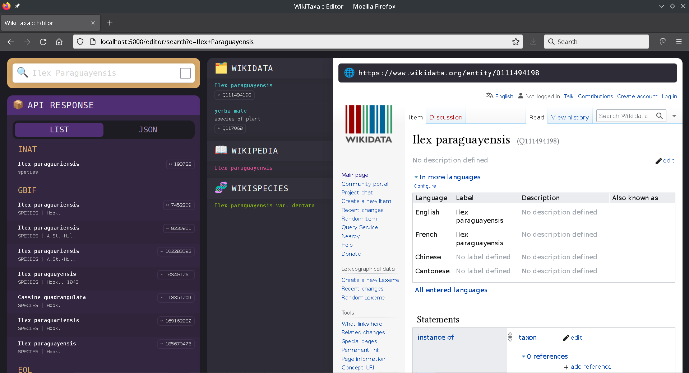

# WikiTaxa

#### WikiTaxa allows you to easily fetch taxonomy reference data for given scientific name.
* Use web Editor to verify and update Wikidata, Wikipedia and Wikispecies pages.
* Use CLI or REST API to fetch taxonomic refrences.

### Sources

Wikidata page related to taxonomic properties, databases section:
* [WikiProject Taxonomy Databases](https://www.wikidata.org/wiki/Wikidata:WikiProject_Taxonomy#Databases)

Taxon properties template (with listed databases): 
* [Template:Taxonomy properties](https://www.wikidata.org/wiki/Template:Taxonomy_properties)

## Usage

#### 🧬 Lib

```javascript
const { 
    sourcesCount: number, 
    performSearch: (query: string, encodeQuery: boolean = true, exact: boolean = false) => object, 
    getWikidata: async (query: string, exact: boolean = false) => Promise => array[object], 
    getWikipedia: async (query: string, exact: boolean = false) => Promise => array[object], 
    getWikispecies: async (query: string, exact: boolean = false) => Promise => array[object]
 } = require('./lib/wikitaxa');
```

#### 🔧 Tools

* ```/editor/search?q={q}``` – displays single taxon check result and related Wiki projects pages

#### 🌐 REST API

* ```/api/search/{q}``` – single taxon check
* ```/api/search/{q1},{q2}…``` – multiple taxon check
* ```/api/list``` – list all cached search results
* ```/api/purge/{q}``` – delete cached search result
* ```/api/status``` – databases access check

#### 💻 CLI

* ```yarn cli {q}``` – single taxon check
* ```yarn cli {q1},{q2}…``` – multiple taxon check

## Supported DBs

* CITES (CITES Species+ ID)
* EBio (eBiodiversity ID)
* EBird (eBird taxon ID)
* EPPO (EPPO Code)
* EOL (Encyclopedia of Life ID)
* FoA (Flora of Australia ID (new))
* GBIF (Global Biodiversity Information Facility ID)
* INaturalist (iNaturalist taxon ID)
* IPNI (International Plant Names Index ID)
* IRMNG (Interim Register of Marine and Nonmarine Genera ID)
* ITIS (Integrated Taxonomic Information System ID)
* LoB (Lepidoptera of Belgium ID)
* PotW (Plants of the World online ID)
* NLSR (Nederlands Soortenregister ID)
* TAXREF ID
* Tropicos ID
* VASCAN ID
* WoRMS (World Register of Marine Species ID)
* ZooBank ID

#### Other supported references

* Britannica (Encyclopedia Britannica Online ID)

## Example

### CLI

```bash
$ npm install
$ npm run cli Ilex Paraguayensis

> @simek/wikitaxa@1.0.0 cli
> node cli/index.js "Ilex" "Paraguayensis"

[
  {
    name: 'Ilex Paraguayensis',
    data: [
      {
        name: 'inat',
        data: {
          id: 193722,
          name: 'Ilex paraguariensis',
          rank: 'species',
          extinct: false
        }
      },
      {
        name: 'gbif',
        data: [
          {
            id: 7452209,
            name: 'Ilex paraguariensis',
            rank: 'SPECIES',
            authorship: 'Hook.'
          },
          {
            id: 8230801,
            name: 'Ilex paraguariensis',
            rank: 'SPECIES',
            authorship: 'A.St.-Hil.'
          },
          {
            id: 102283592,
            name: 'Ilex paraguariensis',
            rank: 'SPECIES',
            authorship: 'A.St.-Hil.'
          },
          {
            id: 103401261,
            name: 'Ilex paraguayensis',
            rank: 'SPECIES',
            authorship: 'Hook., 1843'
          },
...
```

### Local Server

```bash
$ npm install
$ npm install heroku
$ npm run dev
```

Open http://localhost:5000/ and search:




## Contribution

#### 📋 Prerequisites

* [Heroku CLI](https://devcenter.heroku.com/articles/heroku-cli#download-and-install) – runs local server

#### 🛠 Development ([TODO](TODO.md))

* ```yarn dev``` – start web app at `localhost:5000` (with mocked Redis)

